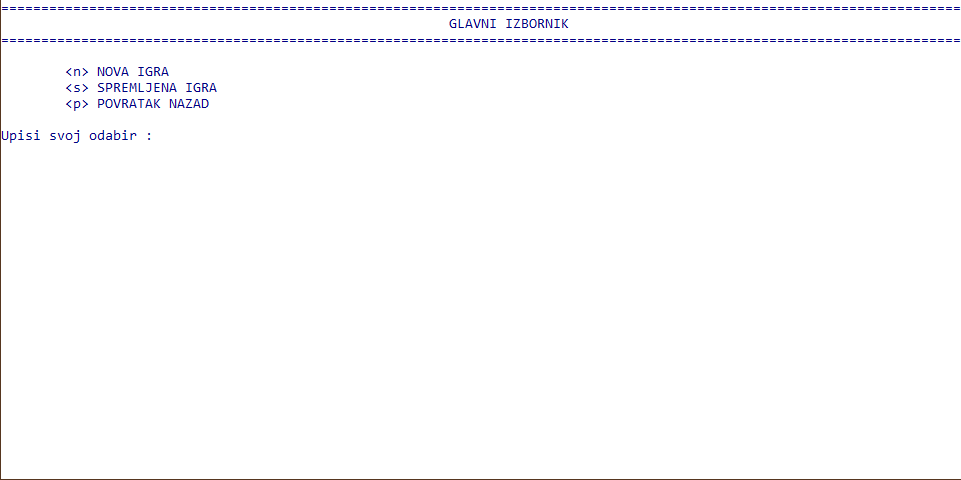
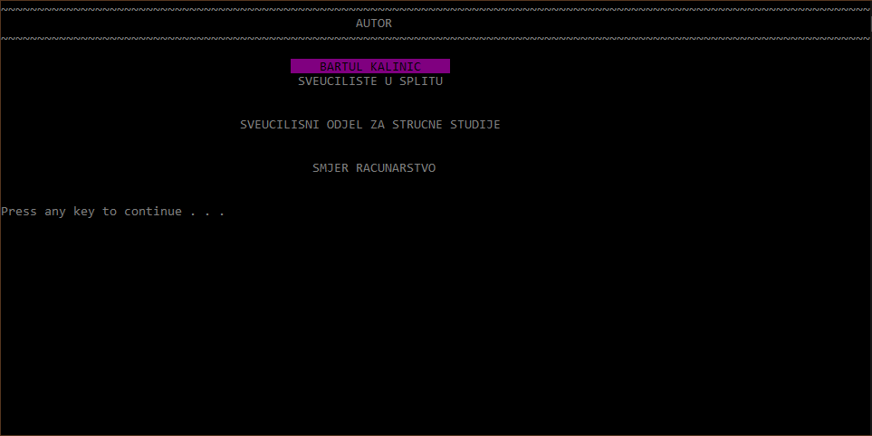

# Console ASCII Sudoku igra

Projekt koji sam izradio je Sudoku, igra u kojoj je cilj znamenkama ispuniti 9x9 mrežu tako da svaki stupac, svaki red i svaka od devet 3x3 podmreža koje čine glavnu ploču sadrže sve znamenke od 1 do 9.
Pritom, u nijednom redu, stupcu ili podmreži ne smije se ponavljati znamenka.

## Obilježja
- interaktivni interface
- provjera unosa kako bi se ispoštovala pravila
- spremanje igre u 3 različita slota
- automatsko rješavanje ploče

## Screenshots
### Početni izbornik
  
### Glavni izbornik
  
### Autor
  
### Izgled igre
  

## Preduvjeti
Kako bi se igra mogla pokrenuti, potrebno je instalirati
- C++ compiler (npr. GCC)
- CMake

## Pokretanje igre
Igra se može pokrenuti na dva načina:
Prvi je tako što korisnik pokreće sljedeće naredbe koristeći Command prompt
1. Klonirati repozitorij:
```shell
git clone https://github.com/bkalinic/kalinic-sudoku-console.git
```
2. Pronaći direktorij
```shell
cd .//pathToDirectory//kalinic-sudoku-console
```
3. Buildati projekt koristeći C++ compiler
4. Pokrenuti igru
```shell
./main
```
Drugi je tako što korisnik
1. Preuzima projekt klikom na "Download ZIP"
2. Raspakira ZIP i builda ga koristeći C++ compiler
3. Pokrene igru
